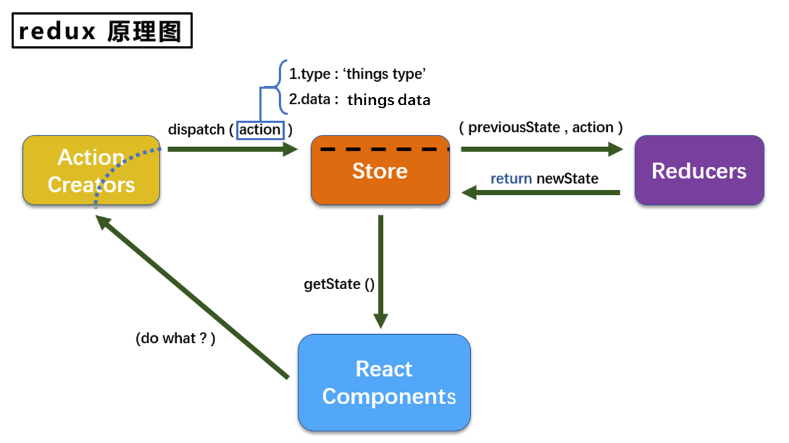
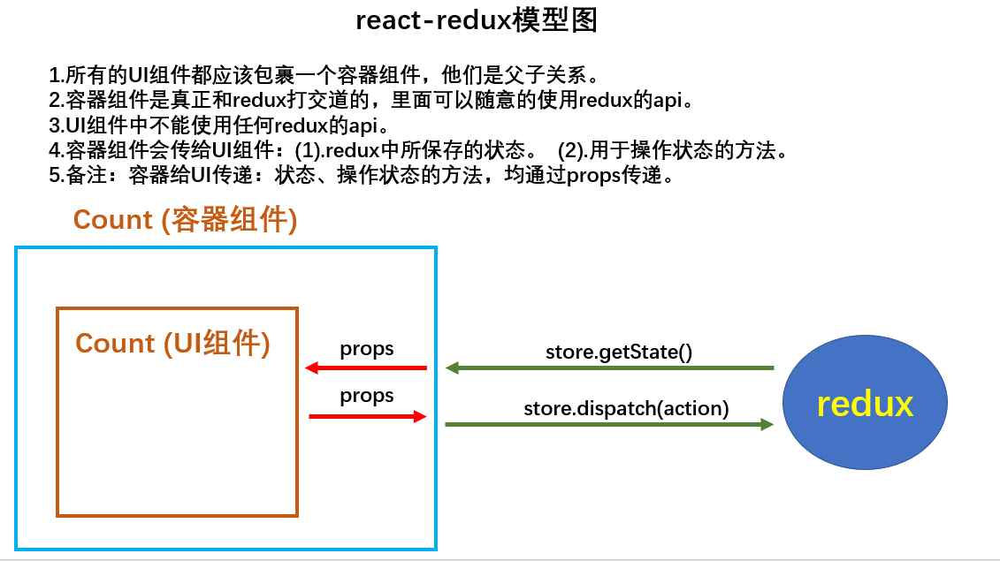

# Redux

[官网](https://redux.js.org/)

[中文文档](https://www.redux.org.cn/)

## Redux 概述

Redux 为何物

- Redux 是用于做 **状态管理** 的 JS 库
- 可用于 React、Angular、Vue 等项目中，常用于 React
- 集中式管理 React 应用多个组件共享的状态

何时用 Redux

- 某个组件的状态，需要让其他组件拿到（状态共享）
- 一个组件需要改变另一个组件的状态（通信）
- 使用原则：不到万不得已不要轻易动用

Redux 工作流程



- 组件想操作 Redux 中的状态：把动作类型和数据告诉 `Action Creators`
- `Action Creators` 创建 `action` ：同步 `action` 是一个普通对象，异步 `action` 是一个函数
- `Store` 调用 `dispatch()` 分发 `action` 给 `Reducers` 执行
- `Reducers` 接收 `previousState` 、`action` 两个参数，对状态进行加工后返回新状态
- `Store` 调用 `getState()` 把状态传给组件

## 核心概念

**`action`** ：

- 表示动作的对象，包含 2 个属性
- `type` ：标识属性，值为字符串，唯一，必须属性
- `data` ：数据属性，类型任意，可选属性
- `{type: 'increment', data: 2}`

**`reducer`** ：

- 用于初始化状态、加工状态
- 根据旧状态和 `action` 产生新状态
- 是**纯函数**

> 纯函数：输入同样的实参，必定得到同样的输出
>
> - 不能改写参数数据
> - 不产生副作用，如网络请求、输入输出设备（网络请求不稳定）
> - 不能调用 `Date.now()` 、`Math.random()` 等不纯方法

**`store`** ：

- Redux 核心对象，内部维护着 `state` 和 `reducer`
- 核心 API
  - `store.getState()` ：获取状态
  - `store.dispatch(action)` ：分发任务，触发 `reducer` 调用，产生新状态
  - `store.subscribe(func)` ：注册监听函数，当状态改变自动调用

## 一个求和案例

```js
// App.jsx

import React, { Component } from 'react'
import Count from './components/Count'

export default class App extends Component {
  render() {
    return (
      <div>
        <Count />
      </div>
    )
  }
}
```

```js
// index.js

import React from 'react'
import ReactDOM from 'react-dom'
import App from './App'
import store from './redux/store'

ReactDOM.render(<App />, document.getElementById('root'))

// 状态改变重新渲染 App 组件
store.subscribe(() => {
  ReactDOM.render(<App />, document.getElementById('root'))
})
```

```js
// redux/constant.js

// 保存常量值
export const INCREMENT = 'increment'
export const DECREMENT = 'decrement'
```

```js
// redux/count_reducer.js

import { INCREMENT, DECREMENT } from './constant'

//初始化状态
const initState = 0
export default function countReducer(preState = initState, action) {
  const { type, data } = action
  switch (type) {
    case INCREMENT:
      return preState + data
    case DECREMENT:
      return preState - data
    default:
      return preState
  }
}
```

```js
// redux/store.js

import { createStore } from 'redux'
//引入为 Count 组件服务的 reducer
import countReducer from './count_reducer'

export default createStore(countReducer)
```

```js
// redux/count_action.js

import { INCREMENT, DECREMENT } from './constant'

export const createIncrementAction = (data) => ({ type: INCREMENT, data })
export const createDecrementAction = (data) => ({ type: DECREMENT, data })
```

```js
// components/Count/index.jsx

import React, { Component } from 'react'
import store from '../../redux/store'
import { createIncrementAction, createDecrementAction } from '../../redux/count_action'

export default class Count extends Component {
  // 可在组件单独监听 Redux 状态变化
  // componentDidMount() {
  // 	store.subscribe(() => {
  // 		this.setState({})
  // 	})
  // }

  increment = () => {
    const { value } = this.selectNumber
    // 将 value 转为数值
    // 手动写 Action 对象
    store.dispatch({ type: 'increment', data: value * 1 })
    // 专门创建 Action 对象
    store.dispatch(createIncrementAction(value * 1))
  }

  decrement = () => {
    const { value } = this.selectNumber
    store.dispatch(createDecrementAction(value * 1))
  }

  incrementAsync = () => {
    const { value } = this.selectNumber
    setTimeout(() => {
      store.dispatch(createIncrementAction(value * 1))
    }, 500)
  }

  render() {
    return (
      <div>
        <h1>当前求和为：{store.getState()}</h1>
        <select ref={(c) => (this.selectNumber = c)}>
          <option value="1">1</option>
          <option value="2">2</option>
          <option value="3">3</option>
        </select>
        <button onClick={this.increment}>+</button>
        <button onClick={this.decrement}>-</button>
        <button onClick={this.incrementAsync}>异步加</button>
      </div>
    )
  }
}
```

- redux 只负责管理状态，状态改变驱动页面展示要自己写
- 可以在 `index.js` 中统一监听状态变化，也可以在组件中单独监听。注意不能直接 `this.render()` 调用 `render` 函数，要通过 `this.setState({})` 间接调用
- `reducer` 由 `store` 自动触发首次调用，传递的 `preState` 为 `undefined` ，`action` 为 `{type: '@@REDUX/ININT_a.5.v.9'}` 类似的东东，只有 `type`

## Redux 异步编程

安装异步中间件：

```bash
npm install redux-thunk -S
```

要点：

- 延迟的动作不想交给组件，而是 `action`
- 当操作状态所需数据要靠异步任务返回时，可用异步 `action`
- 创建 `action` 的函数返回一个函数，该函数中写异步任务
- 异步任务完成后，分发一个同步 `action` 操作状态
- 异步 `action` 不是必要的，完全可以在组件中等待异步任务结果返回在分发同步 `action`

```js
// store.js
import { createStore, applyMiddleware } from 'redux'
import countReducer from './count_reducer'
import thunk from 'redux-thunk'

export default createStore(countReducer, applyMiddleware(thunk))
```

```js
// count_action.js
import { INCREMENT, DECREMENT } from './constant.js'

export const createIncrementAction = (data) => ({ type: INCREMENT, data })
export const createDecrementAction = (data) => ({ type: DECREMENT, data })

// 异步 action 返回一个函数
export const createIncrementAsyncAction = (data, time) => {
  return (dispatch) => {
    setTimeout(() => {
      dispatch(createIncrementAction(data))
    }, time)
  }
}
```

```js
// Count.jsx
incrementAsync = () => {
  const { value } = this.selectNumber
  store.dispatch(createIncrementAsyncAction(value * 1))
}
```

整个过程简单理解：`store` 在分发 `action` 时，发现返回一个函数，那它知道这是个异步 `action` 。因此 `store` 勉为其难地帮忙执行这个函数，同时给这个函数传递 `dispatch` 方法，等待异步任务完成取到数据后，直接调用 `dispatch` 方法分发同步 `action` 。


# React-Redux

> React-Redux 是一个插件库，用于简化 React 中使用 Redux 。



React-Redux 将组件分为两类：

- UI 组件
  - 只负责 UI 呈现，不带有业务逻辑
  - 通过 `props` 接收数据
  - 不能使用 Redux 的 API
  - 保存在 `components` 文件夹下
- 容器组件
  - 负责管理数据和业务逻辑，和 Redux 通信，将结果交给 UI 组件
  - 可使用 Redux 的 API
  - 保存在 `containers` 文件夹下

## React-Redux 基本使用

要点：

- `connect()()` ：创建容器组件
- `mapStateToProps(state)` ：映射状态为 UI 组件标签属性，即传递状态
- `mapDispatchToProps(dispatch)` ：传递操作状态的方法
- 容器组件中的 `store` 是靠 `props` 传进去，而不是在容器组件中直接引入

```js
// containers/Count/index.jsx
// Count 容器组件

import CountUI from '../../components/Count'
import { connect } from 'react-redux'

import { createIncrementAction, createDecrementAction, createIncrementAsyncAction } from '../../redux/count_action'

function mapStateToProps(state) {
  return {
    count: state,
  }
}

function mapDispatchToProps(dispatch) {
  return {
    add: (number) => dispatch(createIncrementAction(number)),
    sub: (number) => dispatch(createDecrementAction(number)),
    addAsync: (number) => dispatch(createIncrementAsyncAction(number, time)),
  }
}

export default connect(mapStateToProps, mapDispatchToProps)(CountUI)
```

```js
// App.jsx
import React, { Component } from 'react'
import Count from './containers/Count'
import store from './redux/store.js'

export default class App extends Component {
  render() {
    return (
      <div>
        <Count store={store} />
      </div>
    )
  }
}
```

```js
// components/Count/index.jsx
// Count UI 组件

increment = () => {
  const { value } = this.selectNumber
  this.props.add(value * 1)
}

decrement = () => {
  const { value } = this.selectNumber
  this.props.sub(value * 1)
}

incrementAsync = () => {
  const { value } = this.selectNumber
  this.props.addAsync(value * 1, 500)
}
```

## 优化写法

`mapDispatchToProps` 可以写成对象形式，React-Redux 底层会帮助自动分发。

```js
// 函数写法
export default connect(
  state => ({count:state}),
  dispatch => ({
    add: number => dispatch(createIncrementAction(number)),
    sub: number => dispatch(createDecrementAction(number)),
    addAsync: (number,time) => dispatch(createIncrementAsyncAction(number,time)),
  })
)(CountUI)

// 对象写法
export default connect(
  state => ({ count: state }),
  {
    add: createIncrementAction,
    sub: createDecrementAction,
    addAsync: createIncrementAsyncAction,
  }
)(CountUI)
```

React-Redux 容器组件可以自动监测 Redux 状态变化，因此 `index.js` 不需要手动监听：

```js
store.subscribe(() => {
  ReactDOM.render(<App />, document.getElementById('root'))
})
```

`Provider` 组件的使用：让所有组件都能获得状态数据，不必一个一个传递

```js
// index.js

import React from 'react'
import ReactDOM from 'react-dom'
import App from './App'
import { Provider } from 'react-redux'
import store from './redux/store'

ReactDOM.render(
  <Provider store={store}>
    <App />
  </Provider>,
  document.getElementById('root')
)
```

整合容器组件和 UI 组件为一个文件：

```js
import React, { Component } from 'react'
import {
	createIncrementAction,
	createDecrementAction,
} from '../../redux/count_action'
import {connect} from 'react-redux'

// 定义 UI 组件
class Count extends Component {
  ...
}

// 创建容器组件
export default connect(
  state => ({count: state}),
  {
    add: createIncrementAction,
    sub: createDecrementAction
  }
)(Count)
```

## 多个组件数据共享

首先规范化文件结构，容器组件和 UI 组件合为一体后放在 `containers` 文件夹。`redux` 文件夹新建 `actions` 和 `reducers` 文件夹分别用于存放每个组件对应的 `action` 和 `reducer` 。

新建 `Person` 组件对应的 `action` 和 `reducer` ：

```js
// redux/actions/person.js

import { ADD_PERSON } from '../constant.js'

export const createAddPersonAction = (personObj) => ({ type: ADD_PERSON, data: personObj })
```

```js
// redux/reducers/person.js

import { ADD_PERSON } from '../constant.js'

const initState = [{ id: 'lsfd', name: 'china', age: '9999' }]
export default function personReducer(preState = initState, action) {
  const { type, data } = action
  switch (type) {
    case ADD_PERSON:
      return [data, ...preState]
    default:
      return preState
  }
}
```

关键步骤：在 `store.js` 中使用 `combineReducers()` 整合多个 `reducer` 来创建 `store` 对象。

这样 Redux 中就以对象的形式存储着每个组件的数据。类似于这样：

```js
{
  total: 0,
  personList: []
}
```

```js
// redux/store.js

import { createStore, applyMiddleware, combineReducers } from 'redux'
import countReducer from './reducers/count'
import personReducer from './reducers/person'
import thunk from 'redux-thunk'

const Reducers = combineReducers({
  total: countReducer,
  personList: personReducer,
})

export default createStore(Reducers, applyMiddleware(thunk))
```

`Person` 组件中获取 Redux 保存的状态，包括其他组件的数据。

```js
import React, { Component } from 'react'
import { connect } from 'react-redux'
import { createAddPersonAction } from '../../redux/actions/person'
import { nanoid } from 'nanoid'

class Person extends Component {
  addPerson = () => {
    const name = this.nameInput.value
    const age = this.ageInput.value
    const personObj = { id: nanoid(), name, age }
    this.props.addPerson(personObj)
    this.nameInput.value = ''
    this.ageInput.value = ''
  }

  render() {
    return (
      <div>
        <h2>在Person组件拿到Count组件的数据：{this.props.count}</h2>
        <input type="text" ref={(c) => (this.nameInput = c)} placeholder="Please input name" />
        <input type="text" ref={(c) => (this.ageInput = c)} placeholder="Please input age" />
        <button onClick={this.addPerson}>添加</button>
        <ul>
          {this.props.personList.map((item) => {
            return (
              <li key={item.id}>
                {item.name} -- {item.age}
              </li>
            )
          })}
        </ul>
      </div>
    )
  }
}

export default connect(
  // state 是 Redux 保存的状态对象
  // 容器组件从 Redux 中取出需要的状态，并传递给 UI 组件
  state => ({personList: state.personList, count: state.total}),
  {
    addPerson: createAddPersonAction
    // 这一行凑数的，为了保持代码格式
    addPerson2: createAddPersonAction
  }
)(Person)
```

一个细节，在 `personReducer` 中，是按如下方式修改状态的，而没有使用 `unshift` 方法。在第二种方式，React 会认为状态没有变化从而不会重新渲染页面，因为 `preState` 保存的是数组地址值，返回的地址和之前的地址是一样的，尽管数组内容发生了改变。而第一种方式返回一个新的数组的地址值，和之前不一样，因此会重新渲染页面。

```js
// 方式一
switch (type) {
  case ADD_PERSON:
    return [data, ...preState]
  default:
    return preState
}

// 方式二
switch (type) {
  case ADD_PERSON:
    preState.unshift(data)
    return preState
  default:
    return preState
}
```

## 纯函数

概念：输入同样的参数，返回同样的输出。

约束：

- 不能修改参数数据
- 不产生任何副作用，如网络请求、输入和输出设备
- 不能调用 `Date.now()` 或 `Math.random()` 等不纯的方法

`reducer` 的函数必须是纯函数。

## Redux 开发者工具

Chrome 安装 Redux DevTools 开发者工具，项目下载依赖包 `npm i redux-devtools-extension --save-dev`，最后在 `store.js` 进行配置：

```js
import { composeWithDevTools } from 'redux-devtools-extension'
...
export default createStore(Reducers, composeWithDevTools(applyMiddleware(thunk)))
// 不需要异步中间件
export default createStore(Reducers, composeWithDevTools())
```

## 项目打包运行

运行命令：`npm run build` 进行项目打包，生成 `build` 文件夹存放着打包完成的文件。

运行命令：`npm i serve -g` 全局安装 `serve` ，它能够以当前目录为根目录开启一台服务器，进入 `build` 文件夹所在目录，运行 `serve` 命令即可开启服务器查看项目效果。
